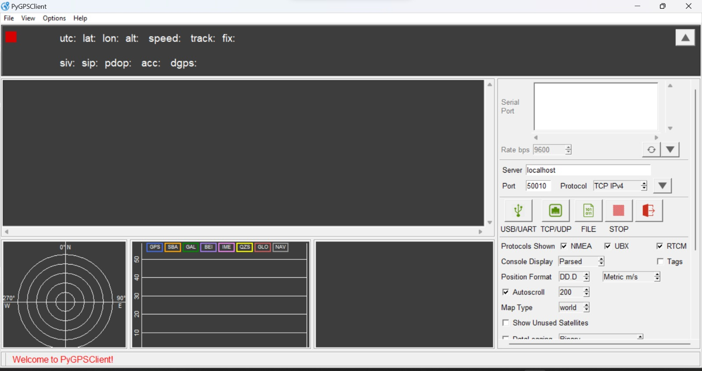
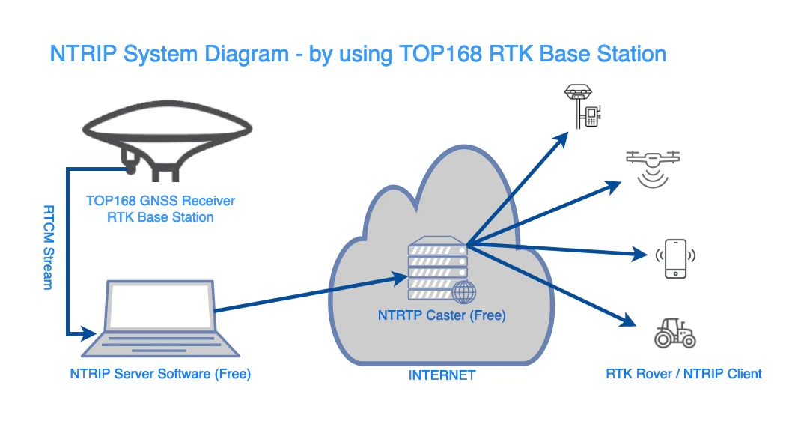

# GNSS RTK Correction Web Application

This project delivers a sophisticated web-based solution for Real-Time Kinematic (RTK) correction reception and monitoring, enhancing the precision of GPS and GNSS systems. Targeting industries like agriculture, construction, and surveying, it addresses the growing need for accurate positioning through a user-centric interface built with modern tech stacks. The application streamlines RTK correction access, provides real-time analytics, and supports customizable data streams, making precision navigation accessible and efficient.

## Project Overview

The GNSS RTK Correction application leverages a robust tech ecosystem to simplify RTK data management. Built with React.js for the frontend, Node.js with Express.js for the backend, and MongoDB for data persistence, it ensures scalability and performance. The system integrates WebSocket for real-time data streaming and RESTful APIs for seamless communication with GNSS receivers and correction sources. It transcends traditional tools by offering interactive visualization, detailed logging, and a dynamic map interface, all tailored to user-specific needs.

## Features

- **Secure Authentication**: Implements JWT-based login/signup for robust user access control.
- **Centralized Dashboard**: Displays real-time RTK metrics in a responsive, modular layout.
- **Live Statistics**: Tracks positioning mode, solution status, geodetic coordinates (lat, lon, height), velocity vectors (E, N, U), and RTK parameters (differential age, AR ratio, baseline).
- **Interactive Visuals**: Features dynamic charts using Chart.js for in-depth data analysis.
- **Correction Logs**: Records timestamps, mount points, and correction metadata for traceability.
- **Data Subscriptions**: Allows customization of RTK streams by mount point, format (RTCM, NMEA), and region.
- **User Configuration**: Supports connection type settings and CORS compatibility.
- **Map Integration**: Offers 2D/3D/satellite views with Leaflet.js, toggling rover and base station perspectives.

## Tech Stack

### Frontend
- **React.js**: Component-based UI with hooks for state management.
- **Chart.js**: Real-time bar charts for interactive data exploration.
- **Leaflet.js**: Dynamic mapping with customizable projections and ellipsoids.
- **Axios**: HTTP client for API requests to backend services.

### Backend
- **Node.js**: Runtime for scalable server-side logic.
- **Express.js**: RESTful API framework for routing and middleware.
- **WebSocket**: Enables real-time bidirectional communication for live updates.
- **JWT**: Secures authentication and session management.

### Database
- **MongoDB**: NoSQL storage for user data, logs, and subscription preferences.
- **Mongoose**: ODM for structured querying and schema validation.

### Dev Tools
- **VS Code**: Primary IDE for development and debugging.
- **Postman**: API testing and endpoint validation.
- **Git**: Version control hosted on GitHub.

## Application Architecture

The application follows a client-server model:
1. **Frontend**: React.js app renders the UI, fetching data via Axios from the Express backend and subscribing to WebSocket streams for live updates.
2. **Backend**: Node.js with Express.js handles API requests, authenticates users via JWT, and processes RTK correction streams from external NTRIP servers.
3. **Data Flow**: MongoDB stores persistent data (logs, user settings), while WebSocket pushes real-time metrics to the dashboard and map.

### Visuals
- 
- 

## Key Components

### Authentication Module
- Implements secure login/signup with JWT tokens stored in localStorage.
- Validates user credentials against MongoDB via Mongoose schemas.

### Dashboard Engine
- Aggregates RTK metrics (e.g., lat/lon, SNR map) using WebSocket feeds.
- Renders modular widgets with React components for a clean UX.

### Real-Time Analytics
- Processes incoming RTK data (e.g., baseline, AR validation) with Node.js.
- Visualizes metrics using Chart.js bar charts, enabling click-to-drill-down functionality.

### Map System
- Integrates Leaflet.js for geodetic visualization (WGS84 ellipsoid default).
- Supports rover/base toggling and view modes (2D tile, 3D tile, satellite).

## Setup Requirements

### Prerequisites
- Node.js (v16.x or later) and npm.
- MongoDB instance (local or cloud, e.g., MongoDB Atlas).
- NTRIP client access for RTK correction streams.
- Browser with WebSocket support (e.g., Chrome, Firefox).

### Configuration
1. Install dependencies: `npm install` in both `client/` and `server/` directories.
2. Set up environment variables in `.env` (backend):
   - `MONGO_URI`: MongoDB connection string.
   - `JWT_SECRET`: Secret key for token signing.
   - `NTRIP_SERVER`: RTK correction source URL.
3. Start MongoDB server.
4. Launch backend: `npm start` in `server/`.
5. Launch frontend: `npm start` in `client/`.

## Usage

- Access the app via `http://localhost:3000` after starting the frontend.
- Log in or sign up to reach the dashboard.
- Monitor live RTK stats (e.g., solution status, velocity) and interact with charts.
- Configure subscriptions (mount point, data rate) in the settings panel.
- Use the map view to visualize rover/base positions in real-time.

## Project Significance

This application redefines RTK correction management by replacing clunky, legacy tools with a modern, scalable platform. Its real-time capabilities, powered by WebSocket and Node.js, ensure sub-meter accuracy for GNSS devices, while MongoDB’s flexibility supports extensive logging and customization. From precision farming to geodetic surveying, it empowers users with actionable insights and seamless control over positioning data.

## Repository Details

- Source code is available in the GitHub repo: https://github.com/akashnb0/GNSS-RTK-Correction.git.
- Key directories:
  - `client/`: React frontend codebase.
  - `server/`: Node.js/Express backend codebase.
- Full documentation is in progress; refer to inline comments for now.

## Notes

- Ensure NTRIP server credentials are valid for correction streams.
- Test WebSocket connectivity if real-time updates lag.
- CORS settings may require adjustment for cross-domain RTK sources.

### Akash S
